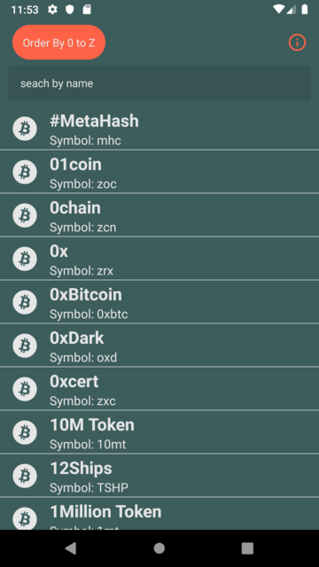
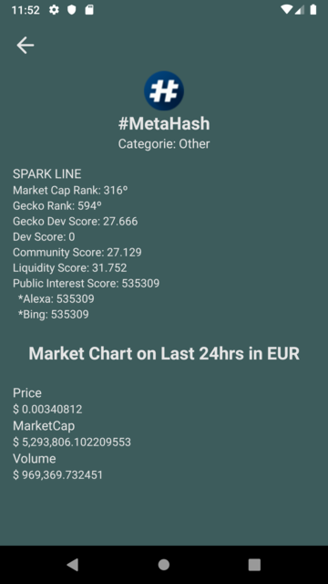
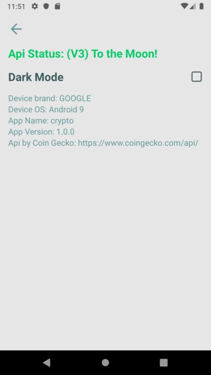

# Desafio React Native - Bume

### About App

- The App has a home screen listing cryptocurrencies that can be sorted from 0 to Z and from Z to 0, can also be filtered by name.

- Clicking on an element in the list takes you to the currency's details page.

- Back at home, there is an info button in the left corner, there you can change the default app theme, api status info and information about your phone, company and operating system and a link to the Gecko API.

### Screenshots

#### dark

#### light

### Additional Packages

#### @react-native-community/async-storage:

- Asynchronous, persistent, key-value storage system for React Native.

#### @react-native-community/netinfo:

- React Native Network Info API for iOS & Android

#### axios:

- Promise based HTTP client for the browser and node.js

#### numeral:

- Format and manipulate numbers.

#### prop-types:

- Runtime type checking for React props and similar objects.

#### react-native-device-info:

- Get device information using react-native

#### react-native-vector-icons:

- Customizable Icons for React Native with support for NavBar/TabBar/ToolbarAndroid, image source and full styling.

#### react-navigation:

- Routing and navigation for your React Native apps

#### react-native-gesture-handler:

- Experimental implementation of a new declarative API for gesture handling in react-native

#### react-native-reanimated:

- More powerful alternative to Animated library for React Native.

#### react-native-screen:

- First incomplete navigation solution for your react-native app.

#### react-navigation-stack:

- Stack navigator component for React Navigation

#### react-redux:

- Official React bindings for Redux

#### redux:

- Predictable state container for JavaScript apps

#### redux-thunk:

- Thunk middleware for Redux.

#### styled-components:

- Visual primitives for the component age. Use the best bits of ES6 and CSS to style your apps without stress

### Run and Build !?!

- Run DEBUG

  - android: in terminal run 'yarn android'
  - ios:

    - Make sure you have installed the pods.
      - Run in terminal 'cd ios'
      - After in terminal 'pod install'
      - Return to previous folder. Run in terminal 'cd ..'
      - Run application with command 'yarn ios'

  - Run RELEASE
    - android:
      - apk: run at the terminal in the root folder the command: 'yarn build:apk'
      - bundle release: run at the terminal in the root folder the command: 'yarn build:bundle'
    - ios:
      - not available

* Make sure you have installed the project packages. Run in terminal 'yarn'.
